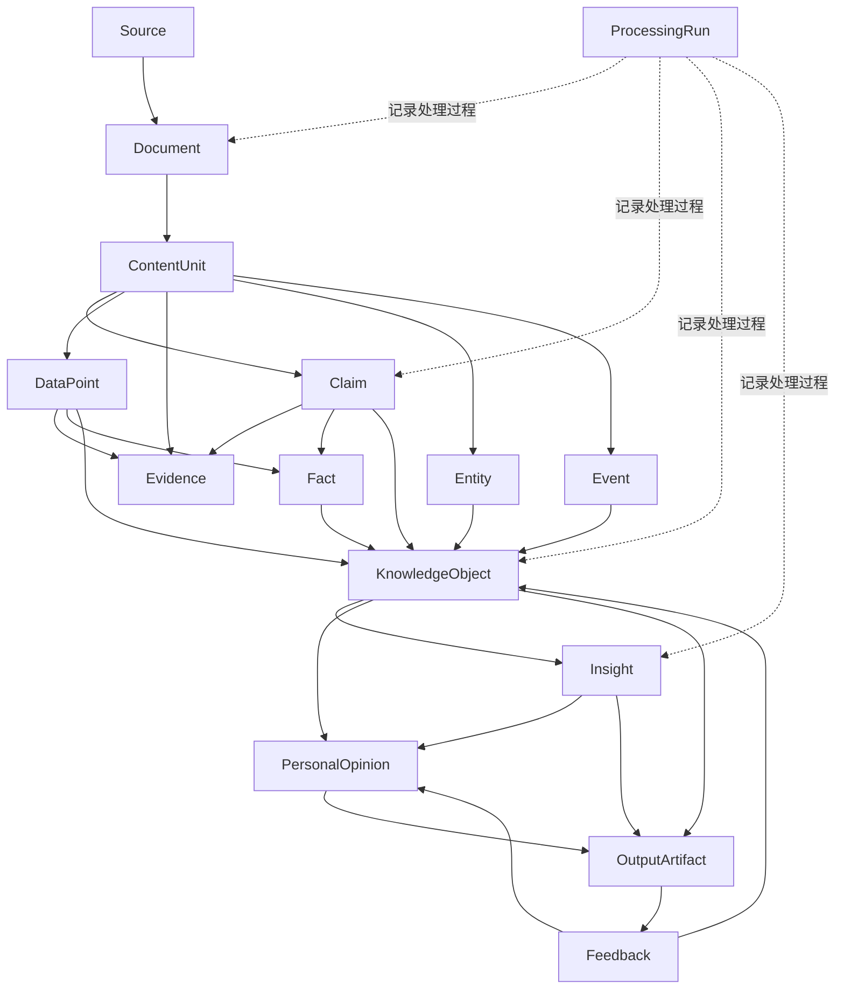

# Aurora 核心对象模型与知识标准 V1.0

> **项目名称**：Aurora Intelligence Platform  
> **文档类型**：核心数据模型与知识治理标准  
> **版本**：V1.0  
> **状态**：设计基线（Design Baseline）  
> **适用阶段**：个人化优先、MVP认知闭环阶段  
> **目标读者**：产品设计、系统架构、数据建模、AI理解、知识库、搜索、Agent 与应用接入开发者  
> **核心定位**：本文件是 Aurora 的“数据宪法”。任何采集器、解析器、AI理解模块、知识库、检索系统、观点引擎和外部应用，都必须遵循本文定义的对象边界、证据链和版本规则。

---

## 1. 本章综述

Aurora 的价值不在于保存多少文件，而在于能否将外部信息转化为：

```text
可追溯的信息
    ↓
可验证的事实与数据
    ↓
可比较的观点与主张
    ↓
可复用的结构化知识
    ↓
可解释的洞察
    ↓
可修正的个人观点
    ↓
可用于真实任务的输出
```

如果对象模型不清晰，系统会迅速出现以下问题：

- 把摘要误当成知识；
- 把观点误当成事实；
- 把 AI 推断误当成外部证据；
- 无法定位结论来自哪段原文；
- 无法区分独立来源与重复转载；
- 无法记录观点如何形成、何时失效；
- 新旧结论相互冲突却无法追溯；
- WQRS 等应用无法判断输入的可信度和时效性。

因此，Aurora V1.0 必须首先建立统一对象模型，并明确：

1. 每类对象代表什么；
2. 每类对象不代表什么；
3. 对象之间如何关联；
4. 派生内容如何追溯到原始来源；
5. 事实、主张、证据、洞察和个人观点如何分层；
6. 如何处理时间、版本、冲突、重复和失效；
7. 哪些字段是 MVP 必需，哪些可以延后。

---

## 2. 设计目标与非目标

### 2.1 设计目标

本模型必须支持以下完整闭环：

```text
Source
  ↓
Document
  ↓
Content Unit
  ↓
Fact / Data Point / Claim / Evidence
  ↓
Knowledge Object
  ↓
Insight
  ↓
Personal Opinion
  ↓
Output Artifact
  ↓
Feedback
  ↓
Revision
```

同时满足：

- **可追溯**：任何结论都能回到原文、页码或时间戳；
- **可区分**：事实、观点、预测、推断和个人判断不混淆；
- **可验证**：对象能够被 Schema 和业务规则校验；
- **可更新**：允许新证据修订旧知识；
- **可解释**：洞察和观点必须展示依据与反方证据；
- **可复用**：相同知识可被 WQRS、AI Research、写作等多个应用消费；
- **可落地**：Python、SQLite/PostgreSQL 和 JSON Schema 可以实现；
- **可渐进扩展**：MVP 不依赖复杂知识图谱或大规模分布式系统。

### 2.2 非目标

V1.0 暂不试图：

- 建立覆盖所有领域的完美本体论；
- 用一个分数判断“绝对真伪”；
- 自动替用户确认个人观点；
- 对所有实体实现完全自动消歧；
- 一次性实现复杂知识图谱；
- 用 AI 生成内容替代外部证据；
- 为所有应用定义业务专属对象；
- 解决所有法律、版权和数据授权问题；
- 建立面向多人、多租户的权限模型。

---

## 3. 核心对象全景

Aurora V1.0 将对象划分为六层。

| 层级 | 对象 | 作用 |
|---|---|---|
| 来源层 | `Source`、`Document`、`ContentUnit` | 保存原始来源及可定位内容 |
| 认知原子层 | `Entity`、`Event`、`DataPoint`、`Claim`、`Evidence`、`Fact` | 表达最小可验证信息 |
| 知识层 | `KnowledgeObject`、`Relation`、`TimelineEntry` | 将原子信息组织为可复用知识 |
| 推理层 | `Insight` | 基于多条知识形成可解释推断 |
| 个人认知层 | `PersonalOpinion` | 保存用户确认的阶段性观点 |
| 应用与反馈层 | `OutputArtifact`、`Feedback`、`ProcessingRun` | 支撑输出、复盘和可重复处理 |

### 3.1 对象关系图



### 3.2 关键边界

- `Document` 是原始内容的系统化表示，不等于知识；
- `Claim` 是某个主体提出的主张，不代表系统认定为事实；
- `Fact` 是经过证据支持、口径和时间限定后，被系统暂时接受的事实性记录；
- `Insight` 是推断，不是外部事实；
- `PersonalOpinion` 属于用户，不能由 AI 自动激活；
- `OutputArtifact` 是面向任务的成果，不是新的外部证据；
- `Feedback` 用于修订认知，不直接覆盖历史版本。

---

## 4. 通用字段与命名标准

所有核心对象应包含一组统一元数据。

### 4.1 通用字段

| 字段 | 类型 | 必需 | 说明 |
|---|---|---:|---|
| `id` | string | 是 | 全局唯一 ID |
| `object_type` | enum | 是 | 对象类型 |
| `schema_version` | string | 是 | Schema 版本，如 `1.0` |
| `status` | enum | 是 | 当前生命周期状态 |
| `created_at` | datetime | 是 | 创建时间，ISO 8601 |
| `updated_at` | datetime | 是 | 最近更新时间 |
| `created_by` | string | 是 | `user`、`system`、模型或模块 |
| `workspace_id` | string | 否 | 个人阶段默认 `default` |
| `language` | string | 否 | BCP 47，如 `zh-CN` |
| `tags` | array[string] | 否 | 受控标签与自由标签 |
| `source_refs` | array[string] | 否 | 关联来源对象 ID |
| `provenance` | object | 是 | 来源和处理链 |
| `privacy_level` | enum | 是 | 数据敏感级别 |
| `deleted_at` | datetime/null | 否 | 软删除时间 |

### 4.2 ID 标准

MVP 推荐采用：

```text
<对象前缀>_<UUID4>
```

例如：

```text
src_550e8400-e29b-41d4-a716-446655440000
doc_550e8400-e29b-41d4-a716-446655440000
clm_550e8400-e29b-41d4-a716-446655440000
```

建议前缀：

| 对象 | 前缀 |
|---|---|
| Source | `src_` |
| Document | `doc_` |
| ContentUnit | `cu_` |
| Entity | `ent_` |
| Event | `evt_` |
| DataPoint | `dat_` |
| Claim | `clm_` |
| Evidence | `evi_` |
| Fact | `fac_` |
| KnowledgeObject | `knw_` |
| Insight | `ins_` |
| PersonalOpinion | `opn_` |
| OutputArtifact | `out_` |
| Feedback | `fbk_` |
| ProcessingRun | `run_` |

原则：

- ID 一经生成，不因标题或内容修改而变化；
- 同一对象的新版本沿用逻辑主 ID，并新增 `version_id`；
- 不使用股票代码、URL、文件名作为唯一主键；
- 外部系统 ID 存入 `external_ids`，不替代 Aurora ID。

### 4.3 字段命名

统一使用：

```text
snake_case
```

时间统一使用：

```text
UTC ISO 8601
2026-07-11T08:30:00Z
```

比例统一保存为：

```text
0.18
```

而不是：

```text
18
18%
```

金额必须同时保存：

```json
{
  "value": 1000000,
  "currency": "CNY",
  "unit": "yuan"
}
```

---

## 5. 来源层对象

# 5.1 Source

### 定义

`Source` 表示信息的来源主体或来源渠道。

它可以是：

- 某个网站；
- 某位作者；
- 某家机构；
- 某个视频账号；
- 某份数据库；
- 用户本人；
- 某个 API。

`Source` 不是具体内容，具体内容由 `Document` 表示。

### 核心字段

```json
{
  "id": "src_xxx",
  "object_type": "source",
  "schema_version": "1.0",
  "name": "某财经访谈账号",
  "source_type": "video_channel",
  "publisher": "某机构",
  "author": "某专家",
  "homepage_url": "https://example.com",
  "domain": "finance",
  "source_quality_tier": "S3",
  "ownership_or_interest": "证券投资相关自媒体",
  "status": "active",
  "privacy_level": "public",
  "provenance": {}
}
```

### `source_type`

建议枚举：

```text
official_website
company_announcement
government_database
academic_journal
research_institution
news_media
video_channel
podcast
social_media
blog
api
local_file
user_note
unknown
```

### 来源质量等级

来源等级仅表示证据环境，不表示内容必然正确。

| 等级 | 含义 | 示例 |
|---|---|---|
| `S1` | 一手、官方、原始记录 | 公司公告、政策原文、原始论文、原始数据 |
| `S2` | 高质量专业二手来源 | 权威媒体、专业研究机构、正式研报 |
| `S3` | 有专业背景的分析与评论 | 专家访谈、行业分析师、技术博客 |
| `S4` | 普通自媒体或社交观点 | 视频博主、论坛、社交媒体 |
| `S5` | 来源未知、不可核验或转载链不明 | 无署名截图、二次搬运、匿名消息 |

注意：

- `S1` 也可能包含错误；
- `S4` 也可能提供有价值线索；
- 来源等级不能代替证据核验；
- 同一作者在不同主题下的可信度可能不同。

---

# 5.2 Document

### 定义

`Document` 表示一次具体的信息载体或内容记录。

例如：

- 一条视频；
- 一篇文章；
- 一份 PDF；
- 一条公告；
- 一期播客；
- 一份用户笔记；
- 一次会议录音。

### 核心字段

```json
{
  "id": "doc_xxx",
  "object_type": "document",
  "schema_version": "1.0",
  "source_id": "src_xxx",
  "document_type": "video",
  "title": "人形机器人产业链的机会与风险",
  "original_url": "https://example.com/video/123",
  "published_at": "2026-06-01T08:00:00Z",
  "collected_at": "2026-06-02T10:00:00Z",
  "authors": ["某专家"],
  "content_hash": "sha256:...",
  "mime_type": "video/mp4",
  "raw_storage_uri": "data/raw/...",
  "parse_status": "parsed",
  "copyright_note": "仅供个人研究",
  "privacy_level": "public",
  "status": "active",
  "provenance": {}
}
```

### 文档状态

```text
discovered
queued
collected
parsed
partially_parsed
failed
archived
superseded
```

### 文档去重

至少计算：

- 原始 URL 规范化结果；
- 文件哈希；
- 正文哈希；
- 标题 + 作者 + 发布时间组合指纹。

不能仅依赖 URL，因为同一内容可能被多个渠道转载。

---

# 5.3 ContentUnit

### 定义

`ContentUnit` 是可以被定位和引用的最小内容片段。

可能是：

- 视频 02:15～02:42 的一段话；
- PDF 第 8 页第 2 段；
- 网页第 5 个段落；
- 表格中的一行；
- 用户笔记中的一个区块。

### 核心字段

```json
{
  "id": "cu_xxx",
  "object_type": "content_unit",
  "document_id": "doc_xxx",
  "unit_type": "transcript_segment",
  "sequence_no": 18,
  "text": "未来三年核心瓶颈可能从减速器转向丝杠和控制系统。",
  "locator": {
    "start_seconds": 135.2,
    "end_seconds": 162.5
  },
  "speaker": "某专家",
  "language": "zh-CN",
  "quality": {
    "parse_quality": "high",
    "asr_confidence": "medium"
  },
  "status": "active",
  "provenance": {}
}
```

### 定位规范

不同文档必须保留适当定位信息：

| 文档类型 | 定位字段 |
|---|---|
| 视频/音频 | `start_seconds`、`end_seconds` |
| PDF | `page_no`、`block_no` |
| 网页 | `paragraph_no`、CSS/XPath 可选 |
| 表格 | `sheet_name`、`row_no`、`column_name` |
| Markdown | `heading_path`、`line_start`、`line_end` |

没有定位信息的派生对象，不得标记为高证据质量。

---

## 6. 认知原子层对象

# 6.1 Entity

### 定义

`Entity` 表示可以独立识别和持续关联的对象。

例如：

- 人物；
- 公司；
- 机构；
- 行业；
- 产品；
- 技术；
- 政策；
- 地点；
- 股票；
- 论文；
- 项目。

### 核心字段

```json
{
  "id": "ent_xxx",
  "object_type": "entity",
  "entity_type": "company",
  "canonical_name": "某科技公司",
  "aliases": ["某科技", "ABC Tech"],
  "external_ids": {
    "stock_code": "000001.SZ"
  },
  "attributes": {},
  "status": "active",
  "provenance": {}
}
```

### 实体消歧原则

MVP 采用“保守合并”：

- 名称相同不代表同一实体；
- 合并前至少比较类型、上下文和外部 ID；
- 无法确认时保留两个实体并标记 `possible_same_as`；
- 用户确认后再执行永久合并；
- 合并操作必须可回滚。

---

# 6.2 Event

### 定义

`Event` 表示在特定时间发生、影响一个或多个实体的事件。

例如：

- 公司发布财报；
- 政策出台；
- 产品发布；
- 高管变更；
- 监管调查；
- 重大融资；
- 行业事故；
- 技术突破。

### 核心字段

```json
{
  "id": "evt_xxx",
  "object_type": "event",
  "event_type": "product_release",
  "title": "某公司发布新一代机器人产品",
  "event_time": {
    "start": "2026-06-01T00:00:00Z",
    "end": null,
    "precision": "day"
  },
  "entities": ["ent_company_xxx", "ent_product_xxx"],
  "location": null,
  "description": "发布新一代产品并披露量产计划。",
  "source_refs": ["doc_xxx"],
  "status": "confirmed",
  "provenance": {}
}
```

### 事件状态

```text
reported
confirmed
disputed
cancelled
ongoing
completed
superseded
```

---

# 6.3 DataPoint

### 定义

`DataPoint` 表示具有明确数值、口径、单位、时间和来源的数据。

### 核心字段

```json
{
  "id": "dat_xxx",
  "object_type": "data_point",
  "metric": "revenue_growth_yoy",
  "value": 0.18,
  "unit": "ratio",
  "entity_id": "ent_company_xxx",
  "period": {
    "start": "2025-01-01",
    "end": "2025-12-31"
  },
  "reported_at": "2026-03-20T00:00:00Z",
  "calculation_method": "reported",
  "source_ref": "cu_xxx",
  "status": "active",
  "provenance": {}
}
```

### 数据点必需口径

任何数值至少明确：

- 指标名称；
- 数值；
- 单位；
- 对象；
- 时间区间或时点；
- 数据来源；
- 原始值或计算值；
- 计算方式；
- 是否经审计或复核。

没有单位、时间或口径的数据，不得作为标准 `DataPoint` 使用。

---

# 6.4 Claim

### 定义

`Claim` 表示某个主体提出的、可以被支持、反驳或验证的主张。

`Claim` 不等于事实。

它可能是：

- 事实性主张；
- 因果解释；
- 预测；
- 推荐；
- 价值判断；
- 风险判断；
- 技术判断。

### 核心字段

```json
{
  "id": "clm_xxx",
  "object_type": "claim",
  "claim_type": "prediction",
  "statement": "未来三年人形机器人出货量将保持高速增长。",
  "subject_entity_ids": ["ent_industry_robotics"],
  "asserted_by": "ent_expert_xxx",
  "asserted_at": "2026-06-01T00:00:00Z",
  "time_horizon": {
    "start": "2026-06-01",
    "end": "2029-06-01"
  },
  "conditions": ["核心零部件成本持续下降"],
  "source_ref": "cu_xxx",
  "epistemic_status": "asserted",
  "status": "active",
  "provenance": {}
}
```

### `claim_type`

```text
fact_claim
interpretation
causal_claim
prediction
recommendation
risk_claim
value_judgment
hypothesis
```

### `epistemic_status`

```text
asserted
under_review
supported
disputed
verified
falsified
outdated
withdrawn
```

### 观点归属纪律

每条 Claim 必须明确：

- 谁说的；
- 什么时候说的；
- 在什么上下文说的；
- 是否是直接引用；
- 是否由 Aurora 推断。

如果没有明确主体，应使用：

```text
asserted_by = unknown
```

而不能默认为作者本人或用户本人。

---

# 6.5 Evidence

### 定义

`Evidence` 表示用于支持、反驳、限定或解释某个 Claim、Fact、Insight 或 Opinion 的证据。

### 核心字段

```json
{
  "id": "evi_xxx",
  "object_type": "evidence",
  "evidence_role": "support",
  "evidence_type": "official_data",
  "target_object_id": "clm_xxx",
  "source_ref": "cu_xxx",
  "summary": "官方数据显示近两年相关产品销量持续增长。",
  "independence_group": "official_dataset_2026Q1",
  "directness": "direct",
  "source_quality_tier": "S1",
  "status": "active",
  "provenance": {}
}
```

### `evidence_role`

```text
support
refute
qualify
context
counterexample
```

### `evidence_type`

```text
direct_quote
official_data
company_filing
research_result
observed_event
expert_testimony
historical_case
derived_calculation
user_observation
unknown
```

### 独立性要求

为了防止“十篇转载等于十个证据”，必须记录：

```text
independence_group
```

如果多个内容都源自同一份公告、同一采访或同一数据集，应归入同一独立证据组。

---

# 6.6 Fact

### 定义

`Fact` 是经过证据支持、时间和口径限定后，被 Aurora 当前知识体系暂时接受的事实性记录。

它不是“永恒真理”，而是：

> 在给定时间、范围和证据条件下，当前可接受的事实。

### 核心字段

```json
{
  "id": "fac_xxx",
  "object_type": "fact",
  "statement": "某公司于2026年6月1日发布新一代机器人产品。",
  "subject_entity_ids": ["ent_company_xxx"],
  "valid_time": {
    "start": "2026-06-01",
    "end": null
  },
  "evidence_ids": ["evi_xxx"],
  "verification_status": "verified",
  "reviewed_by": "system",
  "status": "active",
  "provenance": {}
}
```

### Fact 准入条件

至少满足：

1. 有明确来源；
2. 有可定位原文；
3. 有时间范围；
4. 主体明确；
5. 没有被强证据反驳；
6. 不包含明显价值判断；
7. 重要事实应优先由一手来源支持。

### Fact 与 Claim 的区别

| Claim | Fact |
|---|---|
| 某主体提出的主张 | 系统当前接受的事实性记录 |
| 可以未验证 | 必须经过证据支持 |
| 可以是预测或判断 | 只能是事实性陈述 |
| 保留说话人 | 强调对象、时间和证据 |
| 可被证伪 | 可因新证据修订或失效 |

---

## 7. 知识层对象

# 7.1 KnowledgeObject

### 定义

`KnowledgeObject` 是 Aurora 中可被长期复用的知识单元。

它将多个 Fact、DataPoint、Claim、Entity、Event 和 Evidence 组织为一个有边界、有主题、有时间和有来源的知识结构。

它不是简单摘要。

### 典型类型

```text
topic_card
company_profile
person_profile
industry_card
technology_card
policy_card
event_summary
concept_definition
argument_map
risk_card
case_study
```

### 核心字段

```json
{
  "id": "knw_xxx",
  "object_type": "knowledge_object",
  "knowledge_type": "industry_card",
  "title": "人形机器人产业链关键瓶颈",
  "topic_ids": ["ent_industry_robotics"],
  "summary": "当前核心瓶颈主要集中在执行器、丝杠、控制系统与成本下降。",
  "fact_ids": ["fac_xxx"],
  "data_point_ids": ["dat_xxx"],
  "claim_ids": ["clm_xxx"],
  "evidence_ids": ["evi_xxx"],
  "related_entity_ids": ["ent_xxx"],
  "validity": {
    "as_of_date": "2026-06-10",
    "review_due_at": "2026-09-10"
  },
  "knowledge_status": "active",
  "status": "active",
  "provenance": {}
}
```

### 知识对象准则

- 必须有明确主题；
- 必须注明数据截止时间；
- 事实与观点分开存放；
- 必须能回到来源；
- 不应把多个不相关主题强行塞入同一对象；
- 重要知识应设置复核时间；
- 新版本不能直接覆盖旧版本。

---

# 7.2 Relation

### 定义

`Relation` 表示两个对象之间的明确关系。

例如：

```text
公司 — 属于 — 行业
人物 — 任职于 — 公司
事件 — 影响 — 行业
观点 — 支持 — 洞察
证据 — 反驳 — 主张
```

### 核心字段

```json
{
  "id": "rel_xxx",
  "object_type": "relation",
  "subject_id": "ent_company_xxx",
  "predicate": "belongs_to",
  "object_id": "ent_industry_xxx",
  "valid_time": {
    "start": "2024-01-01",
    "end": null
  },
  "evidence_ids": ["evi_xxx"],
  "status": "active",
  "provenance": {}
}
```

### V1.0 原则

- 关系采用受控谓词；
- 不急于建立完整图谱；
- 优先支持高价值关系；
- 没有证据的关系只能标记为 `hypothesized`；
- 关系变化必须保留时间范围。

---

# 7.3 TimelineEntry

### 定义

`TimelineEntry` 用于将事件、观点和事实按时间组织。

它不是新的事实对象，而是面向检索和展示的索引对象。

### 适用场景

- 某公司重大事件时间线；
- 某位专家观点变化；
- 某项政策演进；
- 某个行业叙事变化；
- 个人观点版本变化。

---

## 8. 推理层对象

# 8.1 Insight

### 定义

`Insight` 是基于多个知识对象、事实、数据和观点形成的高阶推断。

Insight 必须明确：

- 它是推断，不是原始事实；
- 基于哪些知识；
- 推理步骤是什么；
- 有哪些替代解释；
- 当前证据强弱；
- 什么条件会使其失效。

### 核心字段

```json
{
  "id": "ins_xxx",
  "object_type": "insight",
  "title": "产业链瓶颈可能向电力与散热环节迁移",
  "statement": "随着芯片供应改善，AI基础设施的约束可能逐渐转向电力、散热和网络侧。",
  "supporting_object_ids": ["knw_xxx", "fac_xxx", "dat_xxx"],
  "counter_evidence_ids": ["evi_xxx"],
  "reasoning_steps": [
    "算力设备交付持续增长",
    "电力与散热需求同步上升",
    "多个项目披露基础设施约束"
  ],
  "alternative_explanations": [
    "短期项目集中建设造成阶段性瓶颈"
  ],
  "confidence_level": "medium",
  "validity": {
    "as_of_date": "2026-06-10",
    "review_due_at": "2026-08-10"
  },
  "insight_status": "draft",
  "status": "active",
  "provenance": {}
}
```

### Insight 状态

```text
draft
under_review
supported
challenged
revised
invalidated
archived
```

### Insight 纪律

- 不得使用自身生成内容作为外部证据；
- 必须至少引用两个知识原子或一个强一手证据；
- 重要洞察必须展示反方证据；
- 不能因来源数量多就自动提高置信度；
- 必须区分独立证据和重复传播。

---

## 9. 个人认知层对象

# 9.1 PersonalOpinion

### 定义

`PersonalOpinion` 表示用户确认的阶段性个人观点。

它是 Aurora 最重要的个人知识资产之一，但不是永久结论。

### 核心字段

```json
{
  "id": "opn_xxx",
  "object_type": "personal_opinion",
  "title": "人形机器人长期方向正确，但短期商业化仍受成本限制",
  "statement": "我认为人形机器人具有长期产业价值，但未来两年商业化速度主要取决于核心零部件成本和可靠性改善。",
  "topic_ids": ["ent_industry_robotics"],
  "supporting_ids": ["ins_xxx", "fac_xxx"],
  "counter_evidence_ids": ["evi_xxx"],
  "key_assumptions": [
    "核心零部件成本持续下降",
    "制造业场景率先实现规模化"
  ],
  "unknown_variables": [
    "终端需求弹性",
    "安全法规进展"
  ],
  "invalidation_conditions": [
    "核心产品连续两个季度量产进度明显低于预期",
    "单位成本长期无法下降"
  ],
  "confidence_level": "medium",
  "opinion_status": "active",
  "confirmed_by_user": true,
  "confirmed_at": "2026-06-10T10:00:00Z",
  "review_due_at": "2026-09-10T00:00:00Z",
  "version_no": 1,
  "previous_version_id": null,
  "status": "active",
  "provenance": {}
}
```

### Opinion 状态

```text
draft
under_review
active
watch
challenged
revised
invalidated
archived
```

### 激活规则

只有满足以下条件，观点才能进入 `active`：

- 用户明确确认；
- 支持证据可追溯；
- 已列出至少一个反方证据或说明暂无反方证据；
- 已列出关键假设；
- 已定义失效条件；
- 已设置复核时间；
- 已注明数据截止日期。

AI 可以生成草案，但不能自动设置：

```text
confirmed_by_user = true
```

---

## 10. 应用与反馈层对象

# 10.1 OutputArtifact

### 定义

`OutputArtifact` 是为具体用途生成的成果。

例如：

- Markdown 研究报告；
- WQRS 结构化输入；
- 文章提纲；
- 学习卡片；
- 每周简报；
- 决策备忘录。

### 核心字段

```json
{
  "id": "out_xxx",
  "object_type": "output_artifact",
  "output_type": "research_brief",
  "title": "人形机器人主题研究简报",
  "purpose": "支持后续行业研究",
  "audience": "user",
  "content_uri": "data/exports/report.md",
  "knowledge_refs": ["knw_xxx"],
  "insight_refs": ["ins_xxx"],
  "opinion_refs": ["opn_xxx"],
  "as_of_date": "2026-06-10",
  "review_status": "reviewed",
  "status": "active",
  "provenance": {}
}
```

### 输出纪律

每份正式输出必须包含：

- 截止日期；
- 来源范围；
- 事实与观点边界；
- 不确定性；
- 资料缺口；
- 主要引用；
- 适用用途；
- 免责声明（必要时）。

---

# 10.2 Feedback

### 定义

`Feedback` 表示对对象质量、现实结果或用户使用效果的反馈。

### 反馈类型

```text
user_rating
correction
new_evidence
prediction_outcome
application_result
duplicate_report
staleness_report
quality_issue
```

### 核心字段

```json
{
  "id": "fbk_xxx",
  "object_type": "feedback",
  "feedback_type": "new_evidence",
  "target_object_id": "opn_xxx",
  "content": "新数据表明量产进度低于原预期。",
  "effect": "challenge",
  "source_refs": ["doc_new_xxx"],
  "created_by": "user",
  "status": "active",
  "provenance": {}
}
```

### 反馈处理

反馈不得直接覆盖目标对象，而应触发：

```text
review_required
revision_required
invalidate_candidate
no_change
```

---

# 10.3 ProcessingRun

### 定义

`ProcessingRun` 记录一次机器处理过程，用于审计、复现和回滚。

### 核心字段

```json
{
  "id": "run_xxx",
  "object_type": "processing_run",
  "task_type": "claim_extraction",
  "input_object_ids": ["doc_xxx"],
  "output_object_ids": ["clm_xxx", "evi_xxx"],
  "processor": {
    "module": "understanding.claim_extractor",
    "model_provider": "openai",
    "model_name": "example-model",
    "prompt_version": "claim_extract_v1.2",
    "code_version": "git:abc123"
  },
  "started_at": "2026-06-10T09:00:00Z",
  "finished_at": "2026-06-10T09:00:08Z",
  "run_status": "success",
  "quality_flags": [],
  "status": "active",
  "provenance": {}
}
```

### 必要性

没有 `ProcessingRun`，系统无法回答：

- 这条观点由哪个模型提取；
- 使用了哪个提示词；
- 为什么今天与上次结果不同；
- 模型升级后哪些旧内容需要重跑；
- 哪次处理出现了错误。

---

## 11. Provenance：来源与派生链标准

每个派生对象都必须包含 `provenance`。

### 推荐结构

```json
{
  "origin_type": "derived",
  "origin_object_ids": ["cu_xxx"],
  "processing_run_id": "run_xxx",
  "human_review": {
    "reviewed": false,
    "reviewed_by": null,
    "reviewed_at": null
  },
  "derivation_note": "由AI从视频转写片段中提取",
  "source_locator_required": true
}
```

### 来源链原则

完整链路应可表达为：

```text
某个 Insight
    ↓
引用 KnowledgeObject
    ↓
引用 Fact / Claim / DataPoint
    ↓
引用 Evidence
    ↓
定位 ContentUnit
    ↓
回到 Document
    ↓
回到 Source
```

任何一环断裂，都应降低对象的可用等级。

---

## 12. 证据、置信度与质量标准

# 12.1 不使用单一“万能置信度”

Aurora 不应把以下不同概念压缩成一个 0～100 分：

- 来源质量；
- 解析质量；
- 提取准确度；
- 证据支持度；
- 推理可靠性；
- 用户认可程度。

应分别记录。

### 建议维度

```json
{
  "quality": {
    "source_quality": "S2",
    "parse_quality": "high",
    "extraction_confidence": "medium",
    "evidence_strength": "high",
    "reasoning_confidence": "medium",
    "human_review_status": "not_reviewed"
  }
}
```

# 12.2 定性置信等级

用户可见层优先使用：

```text
very_low
low
medium
high
very_high
```

不建议在 V1.0 对用户展示：

```text
73%
86%
```

除非有明确统计模型和校准方法。

# 12.3 证据强度

| 等级 | 说明 |
|---|---|
| `E0` | 无证据，仅为线索 |
| `E1` | 单一弱来源或不可定位来源 |
| `E2` | 单一可定位来源，尚未交叉验证 |
| `E3` | 多个独立来源支持，或一个强一手来源 |
| `E4` | 多个独立一手来源支持，且无重大反证 |
| `E5` | 已经长期验证或有正式审计、实验、法律效力支持 |

注意：

- `E5` 不代表永远不会变化；
- 预测通常不能直接达到 `E5`；
- 社交媒体转发不增加独立证据数量；
- AI 自己生成的解释不能提高证据等级。

---

## 13. 时间、版本与失效标准

# 13.1 三类时间

每个对象应区分：

| 时间 | 含义 |
|---|---|
| `event_time` | 事情何时发生 |
| `published_at` | 来源何时发布 |
| `collected_at` | Aurora 何时采集 |

派生对象还应记录：

```text
created_at
reviewed_at
valid_from
valid_to
review_due_at
```

# 13.2 数据截止时间

任何 Knowledge、Insight、Opinion 和 Output 都必须包含：

```text
as_of_date
```

它表示：

> 该对象基于何时之前的信息形成。

# 13.3 版本标准

推荐字段：

```json
{
  "version_no": 2,
  "previous_version_id": "opn_old_xxx",
  "supersedes_id": "opn_old_xxx",
  "revision_reason": "新增反方证据并调整结论"
}
```

原则：

- 不覆盖历史对象；
- 新版本引用旧版本；
- 旧版本状态改为 `superseded` 或 `revised`；
- 所有修订必须记录原因；
- 用户可查看观点演变时间线。

---

## 14. 去重、转载与伪共识处理

# 14.1 文档级去重

依次使用：

1. URL 规范化；
2. 文件哈希；
3. 正文哈希；
4. 标题、作者和时间；
5. 语义相似度；
6. 人工确认。

# 14.2 主张级去重

两个 Claim 相似时，不直接合并，先判断：

- 是否由不同主体独立提出；
- 是否源自同一原始消息；
- 时间范围是否一致；
- 条件和语气是否一致；
- 一个是事实主张，另一个是否只是转述。

# 14.3 伪共识识别

以下情况不应计为多个独立观点：

- 十家媒体转载同一公告；
- 多个视频引用同一研报；
- 同一作者跨平台重复表达；
- AI 生成摘要再被其他内容引用；
- 同一采访被剪成多个片段。

应通过：

```text
independence_group
original_source_id
repost_of
derived_from
```

建立传播链。

---

## 15. 隐私与敏感数据等级

### 推荐等级

| 等级 | 含义 |
|---|---|
| `public` | 可公开信息 |
| `internal` | 个人项目内部信息 |
| `private` | 个人笔记、未公开材料 |
| `sensitive` | 财务、身份、合同等敏感内容 |
| `restricted` | 不允许发送至外部模型或云端 |

### 处理规则

- `restricted` 默认只能本地处理；
- 日志不得记录完整敏感正文；
- 导出前必须检查隐私等级；
- 公开仓库只保存脱敏样例；
- API 密钥、Cookie、数据库文件不得进入 Git；
- 外部模型调用必须记录数据去向和模型提供商。

---

## 16. 对象生命周期

# 16.1 来源内容生命周期

```text
discovered
→ collected
→ parsed
→ structured
→ reviewed
→ active
→ superseded / archived
```

# 16.2 Claim 生命周期

```text
asserted
→ under_review
→ supported / disputed
→ verified / falsified / outdated
```

# 16.3 Insight 生命周期

```text
draft
→ under_review
→ supported
→ challenged
→ revised / invalidated
→ archived
```

# 16.4 PersonalOpinion 生命周期

```text
draft
→ under_review
→ active
→ watch / challenged
→ revised / invalidated
→ archived
```

### 状态变更要求

- 任何自动状态变更必须记录 `ProcessingRun`；
- 重要状态变更必须产生审计记录；
- `active` 个人观点必须由用户确认；
- 失效不等于删除；
- 历史对象保留用于复盘。

---

## 17. 完整示例：从视频到个人观点

### 17.1 原始输入

一段财经视频：

> “未来三年人形机器人需求会快速增长，但真正制约量产的可能不是需求，而是核心零部件成本和可靠性。”

### 17.2 Source

```json
{
  "id": "src_001",
  "source_type": "video_channel",
  "name": "某行业访谈栏目",
  "source_quality_tier": "S3"
}
```

### 17.3 Document

```json
{
  "id": "doc_001",
  "source_id": "src_001",
  "document_type": "video",
  "title": "人形机器人产业访谈",
  "published_at": "2026-06-01T00:00:00Z"
}
```

### 17.4 ContentUnit

```json
{
  "id": "cu_001",
  "document_id": "doc_001",
  "unit_type": "transcript_segment",
  "text": "未来三年人形机器人需求会快速增长……",
  "locator": {
    "start_seconds": 135.2,
    "end_seconds": 162.5
  },
  "speaker": "某专家"
}
```

### 17.5 Claims

```json
[
  {
    "id": "clm_001",
    "claim_type": "prediction",
    "statement": "未来三年人形机器人需求将快速增长。",
    "asserted_by": "ent_expert_001",
    "source_ref": "cu_001"
  },
  {
    "id": "clm_002",
    "claim_type": "causal_claim",
    "statement": "核心零部件成本和可靠性是量产的主要约束。",
    "asserted_by": "ent_expert_001",
    "source_ref": "cu_001"
  }
]
```

### 17.6 KnowledgeObject

```json
{
  "id": "knw_001",
  "knowledge_type": "industry_card",
  "title": "人形机器人商业化关键约束",
  "claim_ids": ["clm_001", "clm_002"],
  "as_of_date": "2026-06-01"
}
```

### 17.7 Insight

在加入其他论文、公告和访谈后形成：

```json
{
  "id": "ins_001",
  "title": "产业方向明确，但商业化速度取决于成本下降",
  "statement": "多源信息共同支持长期需求，但短期量产速度仍取决于核心零部件成本和可靠性。",
  "supporting_object_ids": ["knw_001", "knw_002", "fac_003"],
  "counter_evidence_ids": ["evi_009"],
  "confidence_level": "medium"
}
```

### 17.8 PersonalOpinion

用户确认后：

```json
{
  "id": "opn_001",
  "title": "人形机器人长期看好、短期审慎",
  "statement": "我认可长期方向，但现阶段不把需求叙事直接等同于商业化兑现。",
  "supporting_ids": ["ins_001"],
  "invalidation_conditions": [
    "核心零部件成本下降速度显著超预期",
    "规模化订单连续兑现"
  ],
  "confirmed_by_user": true,
  "opinion_status": "active"
}
```

这条链路完整保留了：

```text
谁说的
→ 原文在哪里
→ 系统提取了什么
→ 其他证据如何支持或反驳
→ AI形成了什么洞察
→ 用户最终认可了什么
```

---

## 18. MVP 必需对象与延后对象

### 18.1 MVP 必须实现

| 对象 | 优先级 |
|---|---:|
| Source | P0 |
| Document | P0 |
| ContentUnit | P0 |
| Claim | P0 |
| Evidence | P0 |
| Fact | P0 |
| KnowledgeObject | P0 |
| Insight | P0 |
| PersonalOpinion | P0 |
| OutputArtifact | P0 |
| ProcessingRun | P0 |

### 18.2 MVP 可简化

| 对象 | 处理方式 |
|---|---|
| Entity | 先做基础实体，不做复杂消歧 |
| Event | 支持常见事件类型 |
| DataPoint | 支持核心数值字段 |
| Relation | 先用简单关系表 |
| TimelineEntry | 可由事件和版本动态生成 |
| Feedback | 先支持用户修正和新证据 |

### 18.3 延后至 V1.1+

- 完整知识图谱；
- 自动本体学习；
- 复杂多语言实体对齐；
- 贝叶斯证据更新；
- 多用户权限；
- 跨工作区知识隔离；
- 自动预测评分；
- 来源声誉长期统计模型。

---

## 19. 存储实现建议

### 19.1 MVP 推荐

```text
本地文件系统
    ├── 原始文件
    ├── 解析文本
    └── 输出文件

SQLite
    ├── 对象元数据
    ├── 关系
    ├── 状态
    ├── 版本
    └── 审计记录

JSON
    ├── 结构化对象
    └── Schema校验
```

### 19.2 稳定版升级

```text
PostgreSQL
    ├── 结构化对象
    ├── 版本
    ├── JSONB
    └── 全文搜索

对象存储
    └── 原始文件与导出物

向量索引
    └── 语义搜索

图关系
    └── 先使用关系表，必要时再引入图数据库
```

### 19.3 不建议

MVP 阶段不建议：

- 一开始使用多个数据库；
- 一开始引入复杂图数据库；
- 仅靠向量库存储全部知识；
- 将原始文件直接塞入数据库；
- 用一个大 JSON 保存整个系统；
- 不做版本和审计记录。

---

## 20. Schema 与代码组织

GitHub 建议结构：

```text
schemas/
├── v1/
│   ├── common.schema.json
│   ├── source.schema.json
│   ├── document.schema.json
│   ├── content_unit.schema.json
│   ├── entity.schema.json
│   ├── event.schema.json
│   ├── data_point.schema.json
│   ├── claim.schema.json
│   ├── evidence.schema.json
│   ├── fact.schema.json
│   ├── knowledge_object.schema.json
│   ├── insight.schema.json
│   ├── personal_opinion.schema.json
│   ├── output_artifact.schema.json
│   ├── feedback.schema.json
│   └── processing_run.schema.json
└── examples/
```

Python 模型建议：

```text
src/aurora/core/models/
├── common.py
├── source.py
├── document.py
├── claim.py
├── evidence.py
├── knowledge.py
├── insight.py
├── opinion.py
└── processing.py
```

建议使用：

- Pydantic；
- JSON Schema；
- SQLAlchemy；
- Alembic；
- pytest。

---

## 21. 校验规则

### 21.1 通用校验

- [ ] `id` 全局唯一；
- [ ] `object_type` 与 Schema 一致；
- [ ] 时间格式合法；
- [ ] `schema_version` 存在；
- [ ] `status` 在允许枚举内；
- [ ] `provenance` 不为空；
- [ ] 敏感等级已设置。

### 21.2 Claim 校验

- [ ] 有明确陈述；
- [ ] 有主张类型；
- [ ] 有说话主体或明确标记未知；
- [ ] 有来源定位；
- [ ] 预测有时间范围；
- [ ] 因果主张没有被误标为事实。

### 21.3 Fact 校验

- [ ] 有证据；
- [ ] 有时间范围；
- [ ] 有明确主体；
- [ ] 不包含价值判断；
- [ ] 重要事实优先有一手来源。

### 21.4 Insight 校验

- [ ] 有支持对象；
- [ ] 有推理步骤；
- [ ] 标记为推断；
- [ ] 有替代解释或说明暂无；
- [ ] 有复核时间；
- [ ] 不把 AI 输出当外部证据。

### 21.5 PersonalOpinion 校验

- [ ] 用户已确认；
- [ ] 有支持证据；
- [ ] 有反方证据或缺失说明；
- [ ] 有关键假设；
- [ ] 有失效条件；
- [ ] 有复核时间；
- [ ] 有数据截止日期；
- [ ] 保留版本历史。

---

## 22. 测试与验收标准

# 22.1 黄金测试集

第一阶段至少选择 20 条真实资料：

- 5 条视频或音频；
- 5 篇网页；
- 5 份 PDF；
- 5 条用户笔记或混合材料。

人工标注：

- 事实；
- 数据；
- 观点；
- 预测；
- 风险；
- 来源；
- 时间；
- 发言人；
- 支持与反对证据。

# 22.2 验收指标

MVP 不追求虚假的单一总分，至少分别评估：

| 项目 | 核查 |
|---|---|
| 来源追溯率 | 派生对象能否定位原文 |
| 观点归属准确率 | 是否把观点归给正确主体 |
| 类型准确率 | 事实/观点/预测是否分类正确 |
| 关键遗漏率 | 重要信息是否漏提 |
| 幻觉率 | 是否生成原文没有的事实 |
| Schema通过率 | JSON是否符合模型 |
| 人工修订量 | 每条结果需要多少修改 |
| 可用率 | 用户是否愿意保留和复用 |

# 22.3 阶段通过标准

达到以下条件，才进入 Collector/Parser/Understanding 的正式编码阶段：

- [ ] 20 条真实样例都能映射到对象模型；
- [ ] 没有核心信息无法表达；
- [ ] 事实、主张、洞察和个人观点边界清晰；
- [ ] 完整来源链可追溯；
- [ ] 对象字段不过度复杂；
- [ ] MVP 必需字段已冻结；
- [ ] JSON Schema 可以通过程序验证；
- [ ] 用户认可个人观点工作流。

---

## 23. 与后续模块的接口关系

| 模块 | 消费对象 | 产出对象 |
|---|---|---|
| Collector | 外部链接/文件 | Source、Document |
| Parser | Document | ContentUnit |
| Understanding | ContentUnit | Entity、Event、DataPoint、Claim、Evidence |
| Knowledge Builder | 原子对象 | Fact、KnowledgeObject、Relation |
| Search | 全部知识对象 | 检索结果集 |
| Insight Engine | KnowledgeObject、Fact、Claim | Insight |
| Opinion Engine | Insight、Evidence | PersonalOpinion 草案 |
| Workflow | 状态和任务 | ProcessingRun、通知 |
| Output Engine | Knowledge、Insight、Opinion | OutputArtifact |
| WQRS Adapter | Knowledge、Insight、Opinion | WQRS 研究输入 |
| Feedback Engine | 现实结果、用户修改 | Feedback、修订任务 |

---

## 24. GitHub 存放位置

本文件建议存放在：

```text
docs/03_data_model/01_Aurora_核心对象模型与知识标准_V1.0.md
```

它将替换当前骨架中的占位文件：

```text
docs/03_data_model/01_核心对象模型与知识标准.md
```

相关配套文件后续放置在：

```text
docs/03_data_model/
├── 01_Aurora_核心对象模型与知识标准_V1.0.md
├── 02_Aurora_来源与证据分级规范_V1.0.md
├── 03_Aurora_标签与主题体系_V1.0.md
└── 04_Aurora_对象生命周期与版本治理_V1.0.md

schemas/
├── v1/
└── examples/
```

---

## 25. 后续工作顺序

完成本文件后，建议按以下顺序推进：

```text
1. 从本文提取 MVP 必需字段
2. 编写 JSON Schema
3. 选取 20 条真实资料
4. 人工制作黄金标准答案
5. 验证对象模型是否足够表达
6. 修订 V1.0 字段
7. 冻结 MVP Schema
8. 搭建 Python/Pydantic 模型
9. 再开发 Collector 与 Parser
```

下一份建议文档为：

```text
docs/03_data_model/02_Aurora_来源与证据分级规范_V1.0.md
```

但在编写下一份文档之前，应先使用真实资料对本对象模型做一次小规模审计。

---

## 26. 本章结论

Aurora 的核心不是“把所有东西存下来”，而是建立一套稳定的认知对象体系：

```text
来源
→ 文档
→ 内容片段
→ 事实 / 数据 / 主张 / 证据
→ 知识
→ 洞察
→ 个人观点
→ 输出
→ 反馈
→ 修订
```

其中最重要的纪律是：

1. 原始信息与派生知识分离；
2. 事实与观点分离；
3. 外部观点与个人观点分离；
4. 证据与推断分离；
5. AI 输出与外部证据分离；
6. 当前结论与历史版本分离；
7. 信息数量与证据独立性分离；
8. 自动提取与用户确认分离。

只要这些边界保持清晰，Aurora 才能从普通资料库成长为一个能够长期积累、持续修正并服务多个应用的个人认知基础设施。
